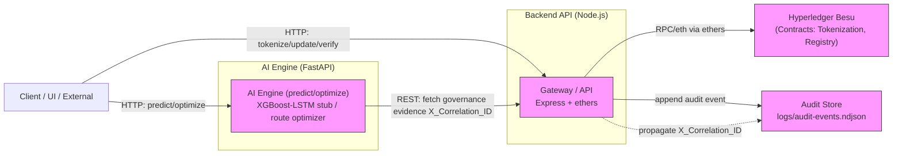

# Ringkasan & Analisis Kode — GARUDA-LINK (PoC)

> Ringkasan komprehensif hasil analisis workspace "PIDI - DIGDAYA x Hackathon".

## TL;DR
- Proyek PoC untuk tokenisasi aset pertanian (GARUDA-LINK) dengan arsitektur hybrid: Node.js backend (DLT gateway) + FastAPI AI Engine + Hyperledger Besu (QBFT).
- Fokus kuat pada auditability, governance, dan fallback deterministik ketika DLT tidak tersedia.
- Struktur modular dengan spesifikasi fitur tersusun (001, 002, 003). Terdapat test suite, skrip verifikasi, dan dokumentasi desain.

## Ringkasan Struktur (tingkat tinggi)
- [README.md](README.md): Petunjuk cepat, arsitektur, fitur, cara menjalankan, dan roadmap.
- `ai-engine/`: FastAPI (Python 3.11), model/servis stub, contract schemas, tests, `requirements.txt`.
  - Entitas utama: `app/main.py`, `routers/*`, `services/*`.
- `backend-api/`: Node.js Express gateway (Node 20+), owner tunggal dari interaksi DLT.
  - Entitas utama: `server.js`, `src/app` (routes, middleware, services), `package.json`, `scripts/`.
- `specs/`: Spesifikasi fitur per branch (001, 002, 003) — requirement, plan, quickstart, checklists.
- `docs/` dan `CHANGELOG.md`: dokumentasi arsitektur, testing, deployment notes.

## Arsitektur & Prinsip Utama
- Backend API = pemegang operasi DLT; semua panggilan ke Besu dilakukan melalui gateway Node.js.
- AI Engine = bounded context terpisah (FastAPI) tanpa panggilan langsung ke DLT (boundary compliance).
- Correlation ID dipropagasi end-to-end untuk membangun evidence bundles dan audit trace.
- Fallback deterministik dan mock-policy untuk menjaga kelangsungan demo saat Besu/eksternal down.

## Komponen Utama — Detil
### Backend API (Node.js)
- Entry: [backend-api/server.js](backend-api/server.js)
- `package.json` menunjukkan versi `0.2.0`, dependency `express`, `ethers`, `dotenv`.
- Scripts: `dev`, `test:integration`, `test:contract`, skrip PowerShell untuk verifikasi fallback/korrelasi.
- Tanggung-jawab: tokenization endpoints, status updates, verification, penyimpanan audit (NDJSON) dan gateway Besu.

### AI Engine (Python FastAPI)
- Entry: [ai-engine/app/main.py](ai-engine/app/main.py)
- Router contoh: `forecast` (`POST /predict/price`) melakukan validasi kualitas data dan menggunakan stub prediksi.
- Service contoh: `governance_aware_pricing.py` menunjukkan pattern integrasi governance context (fetch evidence bundle dari backend) dan menerapkan penyesuaian harga berdasarkan compliance.
- Tests: `ai-engine/tests` memeriksa kontrak API dan aturan boundary (no direct DLT calls).

### DLT (Hyperledger Besu)
- Dijelaskan di docs/specs; konfigurasi untuk QBFT dirujuk di `docker-compose.staging.yml` dan spesifikasi kontrak ada di `backend-api/contracts/abi`.
- Backend menggunakan `ethers` untuk interaksi kontrak.

### Spesifikasi & Governance
- Spesifikasi terstruktur per feature: `specs/001-*`, `specs/002-*`, `specs/003-*`.
- Feature 003 mengandung kontrol governance: evidence bundle endpoint, governance summary, release-readiness checklist.
- Traceability matrix dan acceptance criteria rinci di `specs/001-define-garuda-link-baseline/spec.md`.

## File & Lokasi Kunci
- [README.md](README.md)
- [CHANGELOG.md](CHANGELOG.md)
- [ai-engine/app/main.py](ai-engine/app/main.py)
- [ai-engine/app/routers/forecast.py](ai-engine/app/routers/forecast.py)
- [ai-engine/app/services/governance_aware_pricing.py](ai-engine/app/services/governance_aware_pricing.py)
- [backend-api/server.js](backend-api/server.js)
- [backend-api/package.json](backend-api/package.json)
- [backend-api/logs/audit-events.ndjson](backend-api/logs/audit-events.ndjson) (audit store PoC)
- [specs/001-define-garuda-link-baseline/spec.md](specs/001-define-garuda-link-baseline/spec.md)
- [specs/002-smart-contract-integration/spec.md](specs/002-smart-contract-integration/spec.md)
- [specs/003-enhanced-compliance-governance/spec.md](specs/003-enhanced-compliance-governance/spec.md)

## Cara Menjalankan (ringkasan)
1. Backend API

```powershell
cd backend-api
npm install
npm run dev
```

2. AI Engine

```powershell
cd ai-engine
python -m venv .venv
.\.venv\Scripts\Activate.ps1
pip install -r requirements.txt
uvicorn app.main:app --reload
```

3. (Opsional) Besu lokal via Docker Compose — lihat `docker-compose.staging.yml`.

## Testing
- AI Engine: `python -m pytest tests/` (atau `unittest discover`).
- Backend: `npm run test:integration` (memerlukan Besu running untuk beberapa test).
- Ada skrip PowerShell `backend-api/scripts/verify-*.ps1` untuk verifikasi fallback, correlation audit, governance evidence.

## Observasi Teknis & Kualitas
- Kekuatan:
  - Arsitektur jelas memisahkan tanggung jawab AI vs DLT.
  - Governance & audit dipikirkan dengan matang (correlation ID, evidence bundles, checklists).
  - Terdapat spesifikasi fitur lengkap dan traceability matrix — bagus untuk audit/regulator.
- Risiko / Gap:
  - Beberapa modul AI masih berupa stub/simulasi (mis. forecast_stub), implementasi model XGBoost-LSTM tidak hadir dalam repo.
  - Bergantung pada lingkungan Besu lokal untuk integration tests; reproducibility perlu containerization/CI yang kuat.
  - Audit store PoC berbasis NDJSON; untuk produksi perlu migrasi ke DB (Postgres) dan retention policy.
  - Dokumentasi run/infra cukup baik untuk PoC, namun monitoring/observability (metrics, tracing) belum lengkap untuk produksi.

## Kesimpulan
Repositori ini adalah PoC matang untuk use-case tokenisasi aset pertanian dengan perhatian kuat pada governance dan audit. Fokus ke depan sebaiknya pada reproducibility infrastruktur, implementasi model AI nyata, dan peningkatan observability untuk production readiness.

---

Ringkasan ini dibuat otomatis oleh analisis kode.

## Daftar Fungsi Publik (ringkasan)
Berikut daftar fungsi publik yang ditemukan di komponen utama, disusun per komponen dan diurutkan berdasarkan file/layanan.

### AI Engine (ai-engine)
- `create_app()` — Buat instance FastAPI dan daftarkan router.
- `health_check()` — `GET /health` mengembalikan status layanan.
- `predict_price(payload: PredictPriceRequest) -> PredictPriceResponse` — Endpoint `POST /predict/price`, validasi input dan delegasi ke stub.
- `predict_price_stub(request: PredictPriceRequest) -> PredictPriceResponse` — Service stub yang menghasilkan prediksi harga dan metadata model (mock).
- `optimize_route(payload: OptimizeRouteRequest) -> OptimizeRouteResponse` — Endpoint optimasi rute (router).
- `optimize_route_stub(request: OptimizeRouteRequest) -> OptimizeRouteResponse` — Service stub optimasi rute deterministik untuk PoC.
- `GovernanceAwarePricingService.fetch_compliance_context(correlation_id: str)` — (async) Ambil evidence bundle dari backend (simulasi dalam PoC).
- `GovernanceAwarePricingService.calculate_price(...)` — (async) Hitung harga akhir dengan penyesuaian governance.
- `GovernanceAwarePricingService.assess_pricing_risk(batch_id, correlation_id)` — (async) Lakukan penilaian risiko yang mempertimbangkan konteks governance.
- `main()` — skrip demo async yang menjalankan contoh penggunaan `GovernanceAwarePricingService`.

### Backend API (backend-api)
- `tokenize({ correlationId, payload })` — Gateway: proses mint token (ekspos melalui route `/tokens/tokenize`).
- `updateStatus({ correlationId, tokenId, payload })` — Gateway: update status token di kontrak / fallback.
- `verifyStatus({ correlationId, tokenId })` — Gateway: verifikasi status token.
- `getEvidenceBundle(correlationId)` — Bangun dan kembalikan evidence bundle untuk `correlationId`.
- `getGovernanceSummary({ period, key })` — Hitung dan kembalikan ringkasan governance (daily/release).
- `getReleaseReadiness({ releaseCandidate, override })` — Evaluasi checklist readiness release dan keputusan GO/NO-GO.
- `writeAuditEvent(event)` — Tulis event audit ke `logs/audit-events.ndjson`.
- `readAllAuditEvents()` — Baca semua event audit dari file NDJSON.
- `buildDeterministicFallback({ operation, classification, correlationId })` — Susun respons fallback deterministik ketika Besu tidak tersedia.

Catatan: daftar di atas merangkum fungsi top-level dan API publik antar-komponen. Banyak utilitas internal (fungsi yang diawali `_`), class internals, dan helper test juga ada; bila Anda ingin daftar lengkap per-file, saya bisa mengekspor ke CSV/MD terpisah.

## Diagram Arsitektur (Mermaid)
Berikut diagram arsitektur tinggi dalam format Mermaid. Gunakan ini di editor yang mendukung Mermaid untuk visualisasi.




